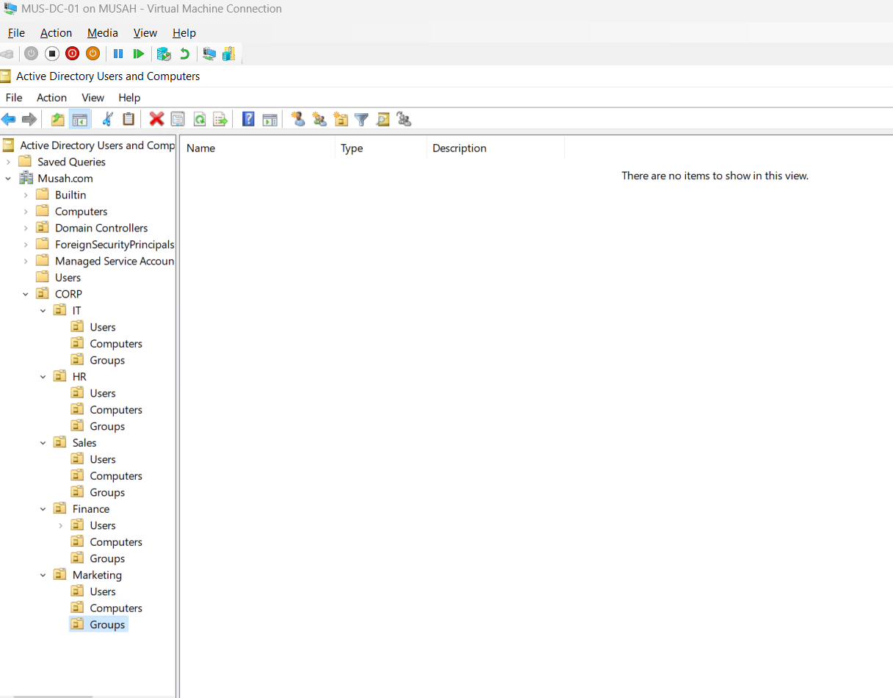
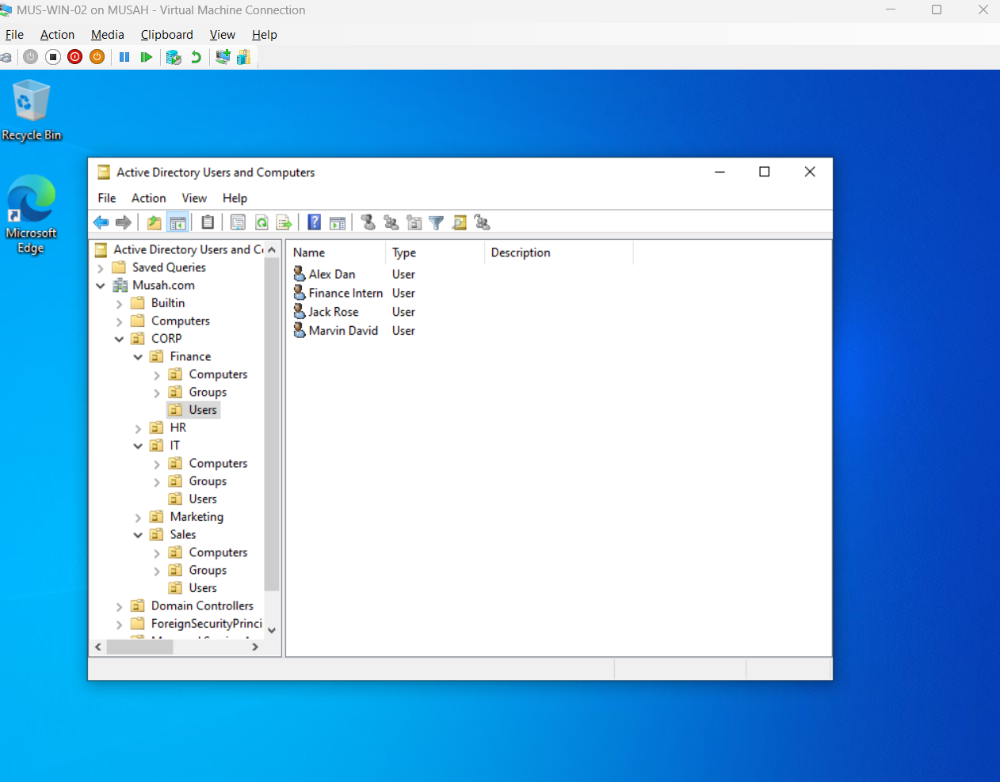
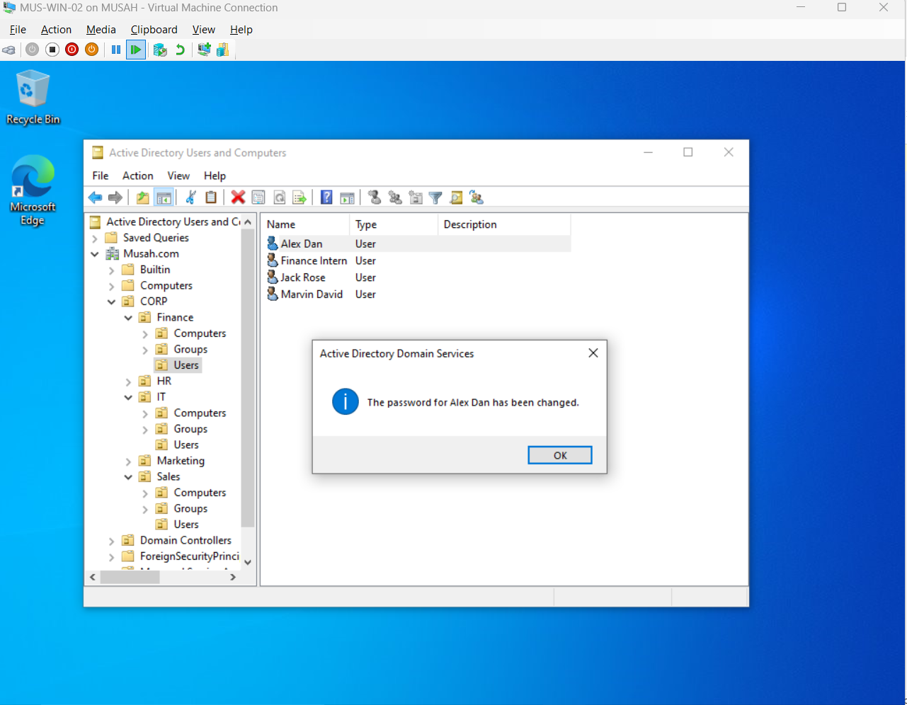
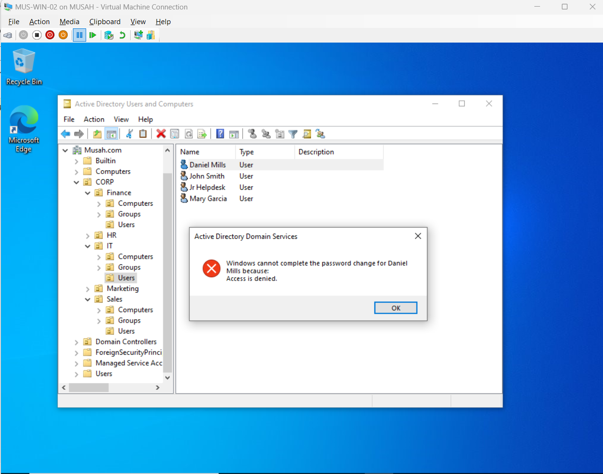
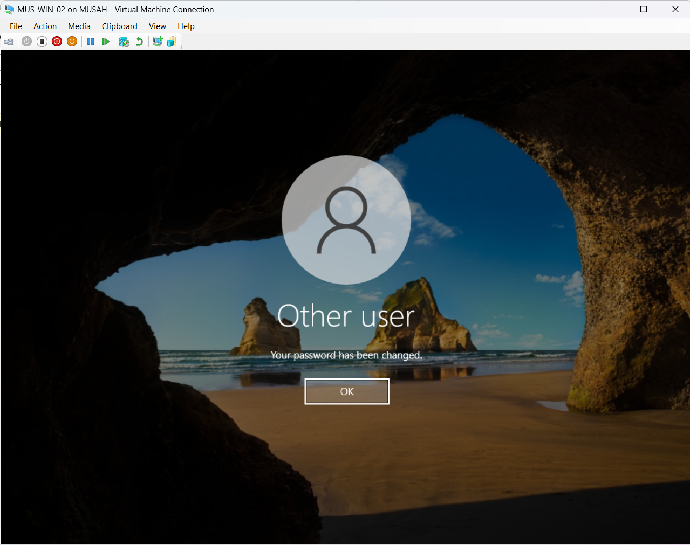

# Active Directory Lab — OU Design, User & Group Management, and Delegated Administration

**Author:** Musah
**Environment:** Hyper-V | Windows Server 2022 | Windows 10 Pro
**Domain:** `Musah.com`
**Role Focus:** IT Support / Systems Administration / Identity & Access Management

---

## Project Summary

I built and administered a fully functional Active Directory environment from scratch — designing a realistic Organizational Unit (OU) hierarchy for a fictional company, provisioning users and security groups across five departments, and implementing the **principle of least privilege** by delegating a narrowly scoped password-reset permission to a junior help-desk account.

The lab demonstrates the day-one skills expected of a Junior Sysadmin / IT Support / Help Desk engineer: standing up a domain controller, joining clients to the domain, structuring AD for real-world delegation and Group Policy targeting, and troubleshooting when things break.

---

## Skills Demonstrated

- Active Directory Domain Services (AD DS) administration
- OU design for delegation and GPO targeting
- User account and security group lifecycle management
- Delegation of Control Wizard (least-privilege model)
- Password policy and account lockout troubleshooting
- Hyper-V virtual networking (internal + external virtual switches)
- Remote Server Administration Tools (RSAT) deployment on Windows 10
- Domain join, interactive logon testing, and forced-password-change workflows

---

## Lab Environment

| Role | Hostname | Operating System |
|---|---|---|
| Domain Controller | `MUS-DC-01` | Windows Server 2022 |
| Client Workstation 1 | `MUS-WIN-01` | Windows 10 Pro (domain-joined) |
| Client Workstation 2 | `MUS-WIN-02` | Windows 10 Pro (domain-joined) |
| Domain (FQDN) | `Musah.com` | — |
| Hypervisor | Hyper-V | — |

---

## Objectives

1. Design a scalable OU hierarchy that mirrors a real company structure.
2. Provision users and security groups per department.
3. Delegate limited administrative rights to a junior help-desk account.
4. Verify the delegation enforces least privilege (success on one OU, failure on another).
5. Document the build, troubleshooting, and validation for portfolio use.

---

## OU Design

```
Musah.com
└── CORP
    ├── Finance
    │   ├── Users
    │   ├── Computers
    │   └── Groups
    ├── HR
    │   ├── Users
    │   ├── Computers
    │   └── Groups
    ├── IT
    │   ├── Users
    │   ├── Computers
    │   └── Groups
    ├── Marketing
    │   ├── Users
    │   ├── Computers
    │   └── Groups
    └── Sales
        ├── Users
        ├── Computers
        └── Groups
```

**Why this structure?** Separating each department into its own OU with standardized `Users / Computers / Groups` sub-OUs gives clean boundaries for (1) delegating administrative rights to a specific team without exposing the whole domain, and (2) targeting Group Policy Objects at the right scope later on.

> 

---

## Implementation

### 1. OU and account provisioning

On `MUS-DC-01`, I opened **Server Manager → Tools → Active Directory Users and Computers**, expanded `Musah.com`, and created the `CORP` parent OU followed by the five department OUs. Inside each department I added the three sub-OUs (`Users`, `Computers`, `Groups`).

I then populated each department's `Users` OU with 3–5 realistic accounts (e.g., **Alex Dan, Jack Rose, Marvin David, Finance Intern** for Finance; **John Smith, Mary Garcia, Daniel Mills, Jr Helpdesk** for IT).

### 2. Security groups

Inside each department's `Groups` sub-OU I created a global security group named after the department (`Finance-Staff`, `HR-Staff`, `IT-Support`, etc.) and added the corresponding department users as members.

I also created a dedicated `IT-JuniorHelp` security group and added the **Jr Helpdesk** account to it — this group would later receive the delegated permission.

> 


### 3. Delegation of Control

Right-clicked the **Finance** OU → **Delegate Control** → added the `IT-JuniorHelp` group → granted the single task **"Reset user passwords and force password change at next logon"** → Finish.

This is the heart of the lab: the Jr Helpdesk account can reset passwords **only** within Finance. Everywhere else in the directory, they are just a standard domain user.

### 4. Validation from a client workstation

Logged into `MUS-WIN-02` as **Jr Helpdesk**, opened ADUC (via RSAT), and tested the boundary in both directions:

- **Finance > Alex Dan → Reset Password → Success.** ADUC returned *"The password for Alex Dan has been changed."*
- **IT > Daniel Mills → Reset Password → Access is denied.** ADUC returned *"Windows cannot complete the password change for Daniel Mills because: Access is denied."*

That single pair of results is the portfolio payoff — a live demonstration of least privilege working exactly as designed.

> 
*Figure 3 — Jr Helpdesk successfully resets a Finance user's password. The delegation is working as designed.*


*Figure 4 — The same Jr Helpdesk account is blocked from resetting a password outside the delegated scope. Least privilege, proven.*


### 5. Forced password change on logon

To close the loop, I logged off and signed back in to `MUS-WIN-02` as the Finance user **adan** using the reset password. Windows correctly prompted *"The user's password must be changed before signing in,"* I set a new complex password, and the system confirmed *"Your password has been changed."* This validates the "force password change at next logon" half of the delegated right.

 
*Figure 5 — On next logon, Windows enforces the password change as specified by the delegated right.*


*Figure 6 — End-to-end workflow complete: reset by help-desk, forced change by user, new credentials in place.*
---

## Issues Encountered & Resolved

Troubleshooting is often more valuable on a portfolio than the happy path. Two real blockers came up during the build:

### Issue 1 — No internet access for RSAT installation

**Symptom:** The lab was running on a Hyper-V *internal* virtual switch, which keeps the VMs isolated from the host's internet connection. When I tried to install **Remote Server Administration Tools (RSAT)** on `MUS-WIN-02` so the Jr Helpdesk account could open ADUC, the install failed because Windows couldn't reach the Microsoft update servers.

**Resolution:** In Hyper-V Manager I created a new **external virtual switch** bound to the host's physical NIC, then attached it to `MUS-WIN-02` as a **secondary network adapter**. This gave the client internet access for the RSAT download **without disturbing the internal lab network or breaking the existing domain join**. RSAT installed successfully and ADUC launched on the client.

**Takeaway:** Dual-homing a VM (internal + external switches) is a clean way to pull updates into an air-gapped lab without re-IP'ing the whole environment.

### Issue 2 — Password complexity policy blocked the reset

**Symptom:** First attempt to reset the `adan` account failed because the new password did not meet the default AD password-complexity requirements (length, character classes). The account also showed as locked.

**Resolution:** I chose a compliant password (meeting length, uppercase, lowercase, numeric, and symbol requirements), ticked **"Unlock the user's account"** in the Reset Password dialog, and the reset completed successfully. The user was then correctly forced to change the password at next logon, as intended by the delegation.

**Takeaway:** The default domain password policy is strict for a reason — always confirm complexity compliance before blaming permissions.

---

## Verification Checklist

- [x] All five department OUs visible under `CORP` with `Users / Computers / Groups` sub-OUs
- [x] 3–5 users provisioned per department
- [x] Department security groups populated with correct members
- [x] `IT-JuniorHelp` group delegated *only* the password-reset right on the Finance OU
- [x] Jr Helpdesk **can** reset Finance passwords from a client PC
- [x] Jr Helpdesk **cannot** reset IT passwords (Access Denied)
- [x] Forced password change at next logon works end-to-end

---

## Key Takeaways

- **OUs are the unit of delegation and GPO targeting.** Getting the structure right on day one pays dividends for every future permission and policy decision.
- **Least privilege is testable.** A one-minute "try it in the other OU and watch it fail" check proves the control is real, not assumed.
- **Lab networking matters.** Internal vs. external Hyper-V switches is a common gotcha — knowing how to dual-home a VM unblocks a lot of "why can't I download X" problems.
- **Password policy failures look like permission failures.** Always rule out complexity before escalating.

---

## Tools & Technologies

`Windows Server 2022` · `Active Directory Domain Services (AD DS)` · `Active Directory Users and Computers (ADUC)` · `Hyper-V` · `Windows 10 Pro` · `RSAT` · `Group Policy` · `PowerShell (baseline)`

---

## Next Projects in This Series

- Group Policy: password policy, drive mapping, desktop lockdown per department
- File server with NTFS + share permissions keyed to the department security groups
- DNS & DHCP on the domain controller
- Baseline hardening (disable SMBv1, audit policy, secure LDAP)

---

*This lab was built end-to-end in a personal home lab for learning and portfolio purposes. All user names, the company name, and the domain are fictional.*
